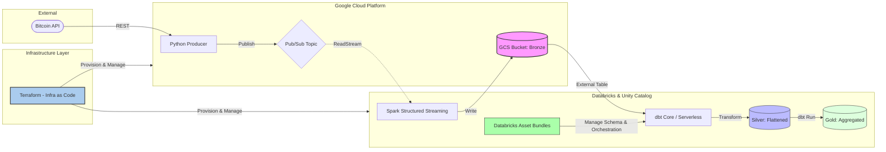

# Real-Time Cryptocurrency Data Pipeline

## 📌 Project Overview
This project is an end-to-end modern data engineering pipeline designed to ingest, process, and model real-time Bitcoin data. It showcases a scalable, event-driven architecture utilizing Google Cloud Platform (GCP) for data ingestion and storage, and the Databricks Lakehouse for stream processing and data modeling.

The entire infrastructure is defined as code (IaC) to ensure reproducibility and seamless deployments.

## 🏗️ Architecture

🛠️ Technology Stack & Responsibilities
Data Ingestion (GCP): A Python producer fetches live data from a REST API and publishes payloads to Cloud Pub/Sub for decoupled, high-throughput messaging.

Stream Processing (Databricks): Spark Structured Streaming subscribes to the Pub/Sub topic and writes raw, append-only records to a Google Cloud Storage (GCS) Bronze layer.

Data Transformation (dbt): dbt handles the ELT process, transforming raw JSON arrays into a flattened Silver layer, and building aggregated business metrics in the Gold layer.

Orchestration: Databricks Asset Bundles (DAB) manage the deployment and scheduling of the data workflows.

Infrastructure as Code: Terraform is used to provision all GCP resources (Pub/Sub, GCS) and Databricks workspaces/clusters, ensuring a robust and version-controlled environment.

🚀 Getting Started
Prerequisites
Google Cloud SDK (gcloud) authenticated

Terraform installed (>= v1.0.0)

Databricks CLI configured

Python 3.11+

Infrastructure Setup
Navigate to the terraform directory:

Bash
cd terraform/
Initialize and apply the infrastructure:

Bash
terraform init
terraform plan
terraform apply
Running the Pipeline
Start the Producer:

Bash
python src/producer.py
Deploy the Databricks Workflow:

Bash
databricks bundle deploy
databricks bundle run [woolie_streaming_job]
Execute dbt Models:

Bash
cd dbt_project/
dbt run
📈 Future Enhancements
Implement a robust CI/CD pipeline for automated testing and deployment of dbt models and Python code.

Add comprehensive data quality tests using dbt test to ensure lineage integrity.

Integrate a BI tool (like Power BI) directly to the Gold layer for real-time dashboarding.

✉️ Contact
Wooliter Chen Data Engineer
